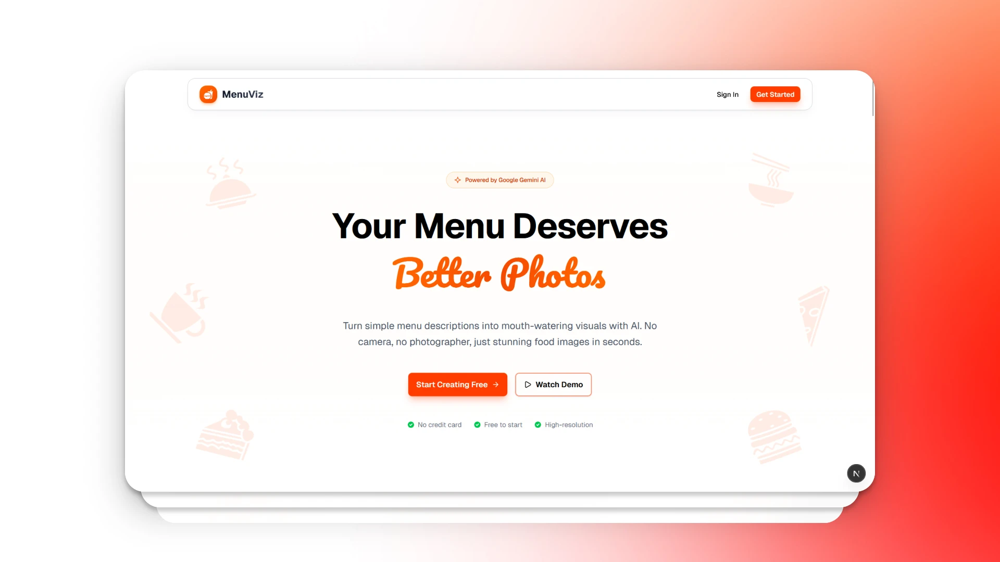

# MenuViz - AI-Powered Menu Visualization

[](https://menuviz.vercel.app)
[](https://github.com/decodewithdeepak/menuviz)
[](https://nextjs.org/)
[](https://www.typescriptlang.org/)
[](https://tailwindcss.com/)

> Transform menu descriptions into stunning food imagery using Google Gemini AI



---

## 🎯 Project Overview

MenuViz is an AI Creative Studio built for restaurants to generate professional food images from text descriptions. No photography needed - just describe your dish and let AI create appetizing visuals for your menu.

**Business Use Case:** Restaurants - Menu Visualizer

---

## ✨ Features Implemented

### Core Features ✅

- **Authentication System**
  - Email/Password signup and login
  - Google OAuth integration
  - Protected routes with automatic redirect
  - Session management with Supabase Auth

- **AI Prompt Enhancement**
  - One-click prompt optimization using Gemini 2.0 Flash
  - Transforms simple descriptions into detailed, professional prompts
  - Real-time preview of enhanced prompts

- **AI Image Generation**
  - Generate high-quality food images using Gemini 2.5 Flash Image
  - Loading states with progress indicators
  - Instant preview and download options

### Bonus Features ✅

- **Style Presets** - 4 pre-defined styles (Photorealistic, Artistic, Minimalist, Rustic)
- **Image Gallery** - Persistent storage with filter, sort, and delete functionality
- **Generation History** - Track all attempts with status (completed/failed/pending)
- **User Settings** - Profile management and account information
- **Custom API Keys** - Use your own Gemini API key or shared key
- **Database Integration** - All data saved to Supabase PostgreSQL

---

## 🛠️ Tech Stack

| Category           | Technology                    |
| ------------------ | ----------------------------- |
| **Framework**      | Next.js 16 (App Router)       |
| **Language**       | TypeScript                    |
| **Styling**        | Tailwind CSS 4                |
| **UI Components**  | shadcn/ui                     |
| **Database**       | Supabase (PostgreSQL)         |
| **Authentication** | Supabase Auth                 |
| **AI Integration** | Vercel AI SDK + Google Gemini |
| **Deployment**     | Vercel                        |

---

## 🚀 Quick Start

### Prerequisites

- Node.js 18+
- Google Gemini API Key
- Supabase Account

### 1. Clone Repository

```bash
git clone https://github.com/decodewithdeepak/menuviz.git
cd menuviz
npm install
```

### 2. Set Up Supabase

1. Create project at [supabase.com](https://supabase.com)
2. Go to **SQL Editor** and run `supabase/schema.sql`
3. Get credentials from **Project Settings → API**
4. Enable Google OAuth in **Authentication → Providers** (optional)
5. Add redirect URL: `http://localhost:3000/auth/callback`

### 3. Configure Environment

Create `.env` file:

```env
GOOGLE_GENERATIVE_AI_API_KEY=your_gemini_api_key
NEXT_PUBLIC_SUPABASE_URL=your_supabase_url
NEXT_PUBLIC_SUPABASE_ANON_KEY=your_supabase_anon_key
NEXT_PUBLIC_SITE_URL=http://localhost:3000
```

**Get API Keys:**

- Gemini: [Google AI Studio](https://makersuite.google.com/app/apikey)
- Supabase: Project Settings → API

### 4. Run Development Server

```bash
npm run dev
```

Open [http://localhost:3000](http://localhost:3000)

---

<!-- ## 📸 Screenshots

### Landing Page

Modern, responsive design with vibrant orange theme and auto-rotating image carousel.

### Dashboard

Clean interface for prompt input, AI enhancement, style selection, and image generation.

### Gallery

Grid layout displaying all generated images with filter, sort, download, and delete options.

### History

Complete audit trail of all generation attempts with status tracking and success rate.

--- -->

## 🎨 Key Features Breakdown

### 1. Authentication Flow

- Email/password signup with validation
- Google OAuth for one-click login
- Automatic profile creation in database
- Protected routes using Next.js 16 proxy
- Secure session management

### 2. Image Generation Workflow

```
User Input → AI Enhancement (optional) → Style Selection → Generate → Save to DB → Display
```

### 3. Database Schema

- **profiles** - User information
- **generated_images** - All generated images with metadata
- **generation_history** - Complete audit trail with status tracking

### 4. Style Presets

Each style automatically enhances prompts with specific keywords:

- **Photorealistic** - Natural lighting, shallow depth of field
- **Artistic** - Vibrant colors, creative composition
- **Minimalist** - Clean aesthetic, white background
- **Rustic** - Warm lighting, wooden textures

### 5. Custom API Keys

Users can configure their own Gemini API key in Settings:

- **Shared Key** - Use the default API key (subject to rate limits)
- **Personal Key** - Configure your own API key for unlimited usage
- **Privacy** - API keys are stored locally in your browser (localStorage)
- **Flexibility** - Switch between shared and personal keys anytime

---

## 🔐 Security Features

- Row Level Security (RLS) on all database tables
- User data isolation (users can only access their own data)
- Environment variables for sensitive credentials
- Secure cookie-based authentication
- Protected API routes

---

## 📁 Project Structure

```
menuviz/
├── app/
│   ├── (auth)/                  # Authentication pages
│   │   ├── login/
│   │   ├── signup/
│   │   └── actions.ts           # Server actions
│   ├── api/                     # API routes
│   │   ├── enhance-prompt/      # Gemini LLM integration
│   │   └── generate-image/      # Gemini Image generation
│   ├── dashboard/               # Main application
│   │   ├── page.tsx             # Image generation
│   │   ├── gallery/             # Image gallery
│   │   ├── history/             # Generation history
│   │   └── settings/            # User settings
│   ├── terms-of-service/        # Terms of Service page
│   ├── privacy-policy/          # Privacy Policy page
│   └── page.tsx                 # Landing page
├── components/
│   ├── ui/                      # shadcn/ui components
│   ├── dashboard/               # Dashboard components
│   ├── landing/                 # Landing page components
│   │   ├── hero.tsx
│   │   ├── image-carousel.tsx
│   │   ├── showcase.tsx
│   │   ├── how-it-works.tsx
│   │   ├── demo.tsx
│   │   ├── features.tsx
│   │   ├── problem.tsx
│   │   ├── cta.tsx
│   │   ├── faq.tsx
│   │   └── index.ts             # Barrel exports
│   └── layout/                  # Shared layout components
│       ├── navbar.tsx
│       ├── footer.tsx
│       └── index.ts             # Barrel exports
├── lib/
│   └── supabase/                # Supabase client configs
│       ├── client.ts            # Client-side
│       ├── server.ts            # Server-side
│       └── middleware.ts        # Session management
├── supabase/
│   ├── schema.sql               # Database schema
│   └── setup.js                 # Connection verification
├── public/
│   └── dishes/                  # Food images (.webp)
├── proxy.ts                     # Next.js 16 route protection
└── env.example                  # Environment template
```

---

## 🧪 Testing

### Test Authentication

1. Visit `/signup` and create account
2. Login with credentials or Google OAuth
3. Verify redirect to dashboard

### Test Image Generation

1. Enter prompt: "Paneer Tikka Masala with naan bread"
2. Click "Enhance with AI"
3. Select style preset
4. Click "Generate Image"
5. Download or regenerate

### Test Gallery & History

1. Generate multiple images
2. View in Gallery with filters
3. Check History for all attempts
4. Test download and delete

---

## 🚧 Challenges & Solutions

### Challenge 1: Google OAuth Redirect Issues

**Problem:** Users remained on login page after OAuth  
**Solution:** Moved OAuth logic to client-side with proper redirect URL configuration

### Challenge 2: Gemini API Quota Limits

**Problem:** Free tier has rate limits  
**Solution:** Implemented proper error handling with user-friendly messages and retry suggestions

### Challenge 3: Image Storage

**Problem:** Large base64 images in database  
**Solution:** Store as data URLs for MVP; production would use Supabase Storage

### Challenge 4: Next.js 16 Middleware Migration

**Problem:** `middleware.ts` deprecated  
**Solution:** Migrated to `proxy.ts` with proper session management

---

## 🔮 Future Improvements

- [ ] Upload images to Supabase Storage instead of base64
- [ ] Batch generation (multiple variations from one prompt)
- [ ] Image editing tools (crop, resize, filters)
- [ ] Export to PDF menu
- [ ] Team collaboration features
- [ ] Usage analytics and statistics
- [ ] Custom style preset creation
- [ ] Advanced generation parameters (temperature, creativity)

---

## 📝 Environment Variables

Required variables (see `env.example`):

```env
# Google Gemini API
GOOGLE_GENERATIVE_AI_API_KEY=

# Supabase
NEXT_PUBLIC_SUPABASE_URL=
NEXT_PUBLIC_SUPABASE_ANON_KEY=

# Site URL
NEXT_PUBLIC_SITE_URL=
```

---

## 🚀 Deployment

### Deploy to Vercel

1. Push code to GitHub
2. Import project to Vercel
3. Add environment variables in Vercel dashboard
4. Update `NEXT_PUBLIC_SITE_URL` to production URL
5. Add production redirect URL in Supabase Auth settings
6. Deploy

---

## 🙏 Acknowledgments

- **Google Gemini** for AI capabilities
- **Supabase** for backend infrastructure
- **Vercel** for hosting and AI SDK
- **shadcn/ui** for beautiful components

---

**Built with ❤️ using Next.js 16, TypeScript, Tailwind CSS 4, and Google Gemini AI**
